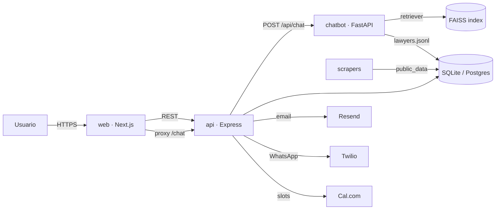

# Moix Legal

Directorio y marketplace legal para Mar del Plata, con chatbot IA que orienta al consultante y lo deriva a un abogado de la red del Dr. Cristian Moix.

## Qué es

Un cliente entra al sitio con un problema legal, conversa con un chatbot que entiende su situación, recibe una recomendación fundamentada de 1 a 3 abogados según especialidad y antecedentes públicos, y puede agendar una consulta directa. Cada lead queda registrado con la trazabilidad "referido por Moix".

La figura del Dr. Moix (penalista, ex rector, docente universitario) opera como ancla de autoridad. Alrededor se organiza una red curada de abogados con perfiles armados a partir de fuentes públicas verificadas (padrón del CAMDP, MEV de la SCBA, CIJ, SAIJ, prensa local).

## Arquitectura

```
moix-legal/
├── api/         # Backend REST — Node.js + Express + SQLite/Postgres
├── chatbot/     # Servicio RAG — Python + FastAPI + LangChain + FAISS
├── web/         # Frontend público — Next.js 14 + TypeScript + Tailwind
├── scrapers/    # Jobs de datos públicos — Python + Playwright
└── docs/        # Documentación transversal
```

Cuatro servicios independientes, desplegables por separado.



## Puesta en marcha rápida (desarrollo local)

Requisitos: Node.js 20, Python 3.11, npm o pnpm, git.

```bash
# 1) API REST
cd api
cp .env.example .env
npm install
npm run seed
npm run dev            # http://localhost:4000

# 2) Chatbot RAG
cd ../chatbot
python -m venv .venv
source .venv/bin/activate    # Windows: .venv\Scripts\activate
pip install -r requirements.txt
cp .env.example .env
uvicorn app.server:app --reload --port 8000

# 3) Frontend
cd ../web
cp .env.example .env.local
npm install
npm run dev            # http://localhost:3000
```

## Deploy rápido a Render

En la raíz hay un `render.yaml` (blueprint). Desde https://dashboard.render.com/ →
**New → Blueprint → conectar `rodsimonc/CC`** se crean los tres servicios
(`moix-legal-api`, `moix-legal-chatbot`, `moix-legal`) en el plan free.
Paso a paso y cableado de URLs cruzadas en `docs/DEPLOY-RENDER.md`.

## Documentación

- `docs/ARCHITECTURE.md` — decisiones arquitectónicas.
- `docs/DEPLOY.md` — despliegue por servicio.
- `docs/DEPLOY-RENDER.md` — deploy en Render con el blueprint.
- `docs/ERROR-CONTRACT.md` — contrato de errores (RFC 7807).
- `docs/LEGAL-COMPLIANCE.md` — Ley 25.326 y reglas del CAMDP.
- `docs/openapi.yaml` — contrato REST completo.
- `CHANGELOG.md` — historial versionado (SemVer).

## Estado

Fase 1 (actual): MVP visual. Landing con chatbot mock, API con CRUD básico y seed, servicio RAG con endpoint eco, docs esqueleto.

Fase 2: chatbot con IA real (Gemini/Claude), agenda con Cal.com, notificaciones por email y WhatsApp, base de datos en producción y autenticación completa.

Fase 3: panel por rol (cada abogado edita su perfil y ve sus leads), vista del Dr. Moix sobre la red, tracking "referido por Moix", reportes mensuales, indexación automática de menciones en prensa local.

Fuentes descartadas del brief inicial (por inviabilidad técnica o legal, documentado en `docs/LEGAL-COMPLIANCE.md`): scraping directo del MEV SCBA, CIJ (discontinuado en mayo 2025) y SAIJ automático. La estadística judicial que quiera mostrar un abogado la carga desde su panel privado.
