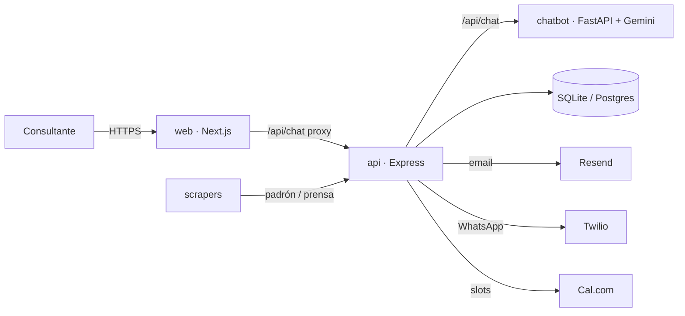

# Estudio Moix Abogados — Sitio institucional

Sitio propio del **Estudio Moix Abogados** (Mar del Plata), un estudio dedicado exclusivamente a **derecho penal**. La landing lleva un asistente virtual con IA que hace el filtro inicial: si el caso es penal, deriva al estudio; si es de otra área, orienta al consultante hacia el fuero correspondiente.

Sobre esta base el proyecto crece en dos portales privados: uno para el equipo del estudio (panel del estudio) y otro para cada cliente (mi caso).

## Fases

- **Fase 1 — En vivo.** Landing institucional, chat con IA real (filtro por área), perfil del titular y placeholders del equipo, áreas de trabajo, FAQ, base técnica lista.
- **Fase 2 — Portal del estudio.** Usuarios y perfiles para cada abogado, casos activos con documentación, notas internas, alta de leads del chat con un click, agenda con Cal.com, notificaciones (email + WhatsApp), edición del perfil público por parte de cada abogado.
- **Fase 3 — Portal del cliente.** Cada cliente entra a un espacio privado por caso: avance, próximos pasos, notificaciones, firma electrónica de documentos y asistente IA interno para preguntas contextuales sobre su causa.

Al terminar, el mismo modelo puede ofrecerse como servicio a otros estudios.

## Arquitectura

```
moix-legal/
├── api/         # Backend REST — Node.js + Express + SQLite/Postgres
├── chatbot/     # Servicio de IA — Python + FastAPI + Gemini (fallback heurístico)
├── web/         # Frontend público + portales — Next.js 14 + TypeScript + Tailwind
├── scrapers/    # Jobs de datos públicos (padrón CAMDP + prensa local)
└── docs/        # Documentación transversal
```

Cuatro servicios independientes, desplegables por separado.



## Puesta en marcha rápida (desarrollo local)

Requisitos: Node.js 20, Python 3.11, npm, git.

```bash
# 1) API REST
cd api
cp .env.example .env
npm install
npm run seed
npm run dev            # http://localhost:4000

# 2) Chatbot (Gemini)
cd ../chatbot
python -m venv .venv
source .venv/bin/activate    # Windows: .venv\Scripts\activate
pip install -r requirements.txt
cp .env.example .env         # Setear GOOGLE_API_KEY
uvicorn app.server:app --reload --port 8000

# 3) Frontend
cd ../web
cp .env.example .env.local
npm install
npm run dev            # http://localhost:3000
```

## Documentación

- `docs/ARCHITECTURE.md` — decisiones arquitectónicas.
- `docs/DEPLOY.md` — despliegue por servicio.
- `docs/DEPLOY-RENDER.md` — deploy en Render con el blueprint.
- `docs/ERROR-CONTRACT.md` — contrato de errores (RFC 7807).
- `docs/LEGAL-COMPLIANCE.md` — Ley 25.326 y reglas del CAMDP.
- `docs/openapi.yaml` — contrato REST completo.
- `CHANGELOG.md` — historial versionado (SemVer).

## Estado

Fase 1 en vivo: landing del estudio + chat con IA real (Gemini). Fase 2 y 3 arrancan cuando el estudio confirme el pivot.
