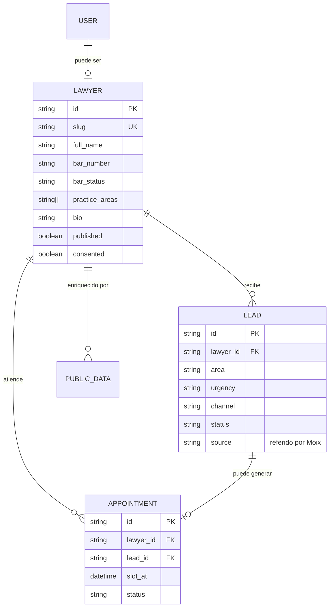

# Arquitectura

Documento de decisiones arquitectónicas. Formato ADR liviano: contexto, decisión, consecuencias.

## Visión general

Separación clara entre el backend transaccional (`api/`) y el servicio de IA (`chatbot/`). El frontend consume ambos, pero el chatbot nunca escribe directo en la base — pasa siempre por la API. Los scrapers son procesos batch aislados.

```
[web] ──► [api] ──► [SQLite/Postgres]
   └───► [api /chat] ──► [chatbot] ──► [FAISS]
                             ▲
                             │
                    [scrapers] ── curación ──► [api]
```

## ADR-001 — Dos servicios, no monolito

**Contexto.** El chatbot requiere Python (LangChain, FAISS, embeddings), mientras que la API transaccional se resuelve más rápido en Node.js siguiendo el patrón del bootcamp (portfolio-api).

**Decisión.** Se separan en dos servicios independientes. El frontend habla con la API; la API hace proxy al chatbot cuando corresponde. Ambos servicios son desplegables por separado.

**Consecuencias.** Más overhead operativo (dos runtimes), pero cada servicio evoluciona en su propio stack. La API mantiene la autoridad sobre datos; el chatbot es un consumidor.

## ADR-002 — SQLite en dev, Postgres en prod

**Contexto.** El dev local tiene que arrancar sin dependencias externas. Prod necesita durabilidad y concurrencia real.

**Decisión.** SQLite en desarrollo, Postgres (Supabase) en producción. Los repositorios abstraen el driver.

**Consecuencias.** Onboarding trivial en local. Migraciones tienen que probarse en ambos motores antes de mergear.

## ADR-003 — Chatbot lee, API escribe

**Contexto.** El chatbot recomienda abogados y captura leads. Podría tener su propia conexión a DB.

**Decisión.** El chatbot solo lee (índice FAISS sincronizado desde `lawyers.jsonl`). La creación de leads y turnos pasa por la API vía HTTP. Un único camino de escritura.

**Consecuencias.** Una única fuente de verdad transaccional. El chatbot puede reiniciarse sin comprometer datos. El costo es una llamada HTTP extra por lead.

## ADR-004 — Curación humana obligatoria antes de publicar perfil

**Contexto.** El sitio combina datos verificados en el padrón del CAMDP con menciones extraídas de prensa local y con información aportada por el propio abogado. La agregación de datos personales, aún con fuentes públicas, requiere consentimiento (Ley 25.326) y respeto de las reglas del CAMDP sobre publicidad profesional.

**Decisión.** Todo perfil queda en estado `draft` hasta obtener consentimiento explícito del abogado. Sin coincidencia en el padrón oficial del CAMDP, no se publica. Se descarta el scraping directo del MEV SCBA (login obligatorio y fuero penal restringido) y del CIJ (discontinuado en 2025); la estadística judicial la aporta el propio abogado si desea mostrarla.

**Consecuencias.** El sitio nunca lista un abogado sin verificación. Se pierde velocidad de alta, se gana confianza y cumplimiento. La agenda de trabajo baja el alcance del componente `scrapers/` respecto al brief inicial: en producción solo corren fuentes públicas sin autenticación (padrón CAMDP y prensa local indexada).

## ADR-005 — JWT propio, sin OAuth

**Contexto.** El sitio tiene tres roles (público, abogado, admin). No hay integración con proveedores externos en Fase 1.

**Decisión.** JWT HS256 firmado por la API, con `iss`, `aud`, `exp` y `sub` obligatorios. Rechazo explícito de `alg: none`. Contraseñas con `scrypt`.

**Consecuencias.** Menos superficie que un proveedor externo. Hay que rotar el secreto y documentarlo.

## ADR-006 — Errores con Problem Details (RFC 7807)

**Contexto.** Necesitamos un formato de error único para toda la API y consumible desde el frontend con `zod`.

**Decisión.** Toda respuesta 4xx/5xx sigue el formato de `application/problem+json` con `type`, `title`, `status`, `detail`, `instance` y campos custom prefijados (`x-`).

**Consecuencias.** El frontend tiene un único handler. Documentado en `docs/ERROR-CONTRACT.md`.

## Diagrama de datos (simplificado)


